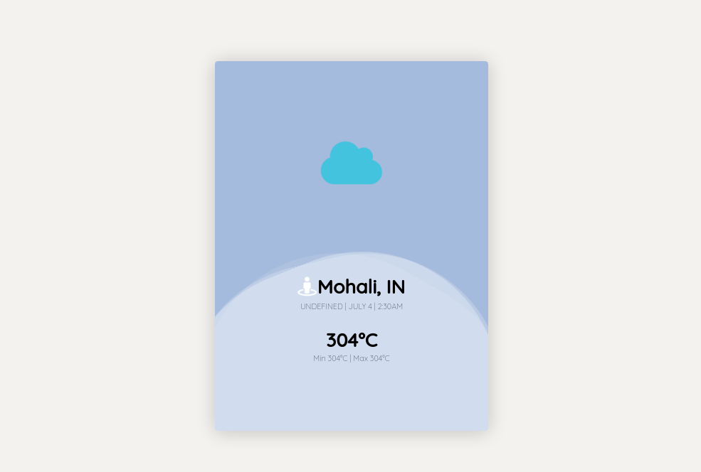

- Screenshot



# WeatherApp
Weather app in node js

### 1
- Please install npm
- install node 

```
    npm install
    node install or node i -g
    


### 1.1
- please install nomemon library
```
    npm i nodemon
    or 
    npm install -g nodemon

```